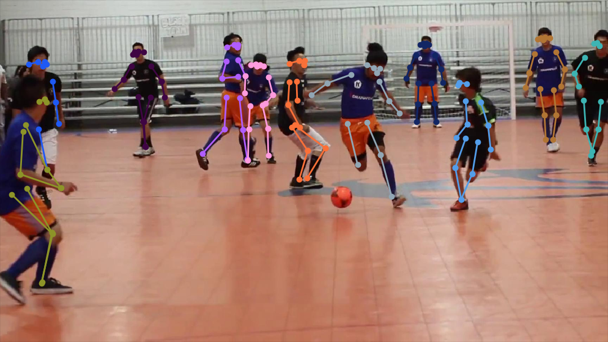

# Objetivo del proyecto
  
  Con el presente proyecto queremos recoger un conjunto de imagenes posturales 
  para darles diferente uso o aplicación, por ejemplo:
  
     Poder hacer ejercicios de rehabilitación desde casa para pacientes.
     
     
     Hacer ejericios de pilates, la aplicación te muestra una imágen y te pide 
     mantener dicha postura x segundos.
     
     
     Medicina del trabajo en caso de que el proyecto escale, monitorizar a empleados
     para reducir riesgos y dar alarmas para corregir postura o hacer descansos. 
     
     

# Referencias para el proyecto final de AI-Saturdays

### Datasets posturales - Referencias

    https://github.com/trrahul/densepose-video
    
    http://densepose.org/
    
    https://research.fb.com/facebook-open-sources-densepose/
    
    https://github.com/eldar/pose-tensorflow
    
    https://github.com/MVIG-SJTU/AlphaPose

# Contribuidores

   Marta Ventosa \
   Raquel \
   Will \
   Estela Balboa
   
# Agradecimientos
  Ai-Saturdays \
  [Pablo Talavante](https://github.com/pablotalavante) \
  [Marcos Gómez](https://github.com/margobra8) \
  [David Griñán]()
  

# Proyecto Base: Human Pose Estimation with TensorFlow



Here you can find the implementation of the Human Body Pose Estimation algorithm,
presented in the [DeeperCut](http://arxiv.org/abs/1605.03170) and [ArtTrack](http://arxiv.org/abs/1612.01465) papers:

**Eldar Insafutdinov, Leonid Pishchulin, Bjoern Andres, Mykhaylo Andriluka and Bernt Schiele
DeeperCut:  A Deeper, Stronger, and Faster Multi-Person Pose Estimation Model.
In _European Conference on Computer Vision (ECCV)_, 2016**

**Eldar Insafutdinov, Mykhaylo Andriluka, Leonid Pishchulin, Siyu Tang, Evgeny Levinkov, Bjoern Andres and Bernt Schiele
ArtTrack: Articulated Multi-person Tracking in the Wild.
In _Conference on Computer Vision and Pattern Recognition (CVPR)_, 2017**

<p align="center">
    <a href="https://www.mpi-inf.mpg.de/departments/computer-vision-and-multimodal-computing/"></a>
</p>

For more information visit http://pose.mpi-inf.mpg.de

## Prerequisites

The implementation is in Python 3 and TensorFlow. We recommended using `conda` to install the dependencies.
First, create a Python 3.6 environment:

```bash
conda create -n py36 python=3.6
conda activate py36
```

Then, install basic dependencies with conda:

```bash
conda install numpy scikit-image pillow scipy pyyaml matplotlib cython
```

Install TensorFlow and remaining packages with pip:
```bash
pip install tensorflow-gpu easydict munkres
```

When running training or prediction scripts, please make sure to set the environment variable
`TF_CUDNN_USE_AUTOTUNE` to 0 (see [this ticket](https://github.com/tensorflow/tensorflow/issues/5048)
for explanation).

If your machine has multiple GPUs, you can select which GPU you want to run on
by setting the environment variable, eg. `CUDA_VISIBLE_DEVICES=0`.

## Demo code

Single-Person (if there is only one person in the image)

```
# Download pre-trained model files
$ cd models/mpii
$ ./download_models.sh
$ cd -

# Run demo of single person pose estimation
$ TF_CUDNN_USE_AUTOTUNE=0 python3 demo/singleperson.py
```

Multiple People

```
# Compile dependencies
$ ./compile.sh

# Download pre-trained model files
$ cd models/coco
$ ./download_models.sh
$ cd -

# Run demo of multi person pose estimation
$ TF_CUDNN_USE_AUTOTUNE=0 python3 demo/demo_multiperson.py
```

## Training models

Please follow these [instructions](models/README.md)

## Citation
Please cite ArtTrack and DeeperCut in your publications if it helps your research:

    @inproceedings{insafutdinov2017cvpr,
	    title = {ArtTrack: Articulated Multi-person Tracking in the Wild},
	    booktitle = {CVPR'17},
	    url = {http://arxiv.org/abs/1612.01465},
	    author = {Eldar Insafutdinov and Mykhaylo Andriluka and Leonid Pishchulin and Siyu Tang and Evgeny Levinkov and Bjoern Andres and Bernt Schiele}
    }

    @article{insafutdinov2016eccv,
        title = {DeeperCut: A Deeper, Stronger, and Faster Multi-Person Pose Estimation Model},
	    booktitle = {ECCV'16},
        url = {http://arxiv.org/abs/1605.03170},
        author = {Eldar Insafutdinov and Leonid Pishchulin and Bjoern Andres and Mykhaylo Andriluka and Bernt Schiele}
    }

